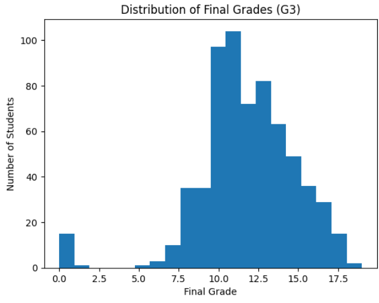
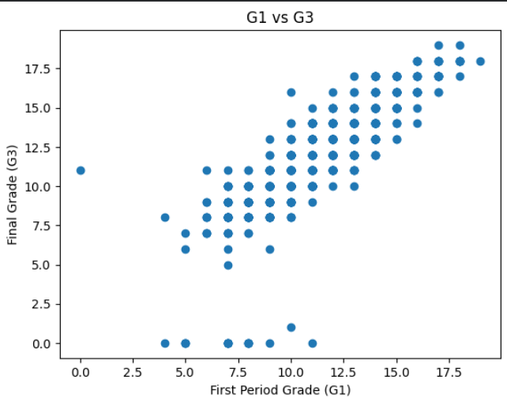
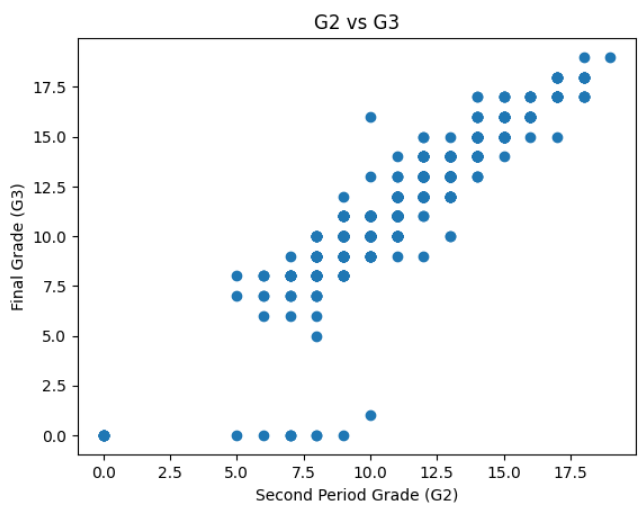
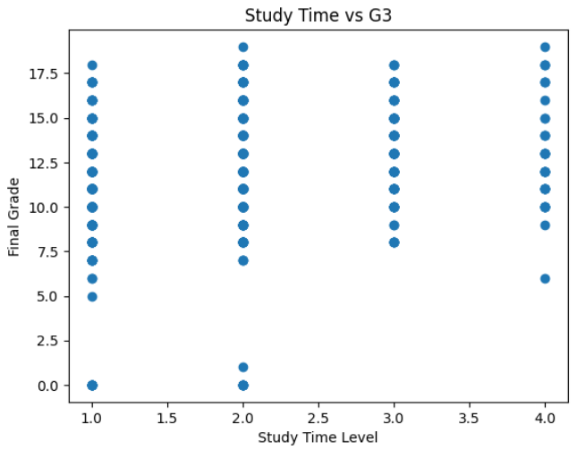
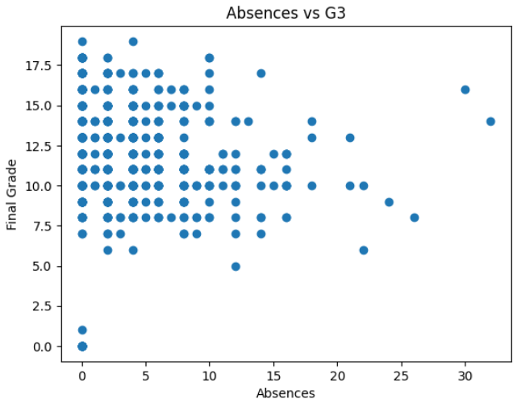
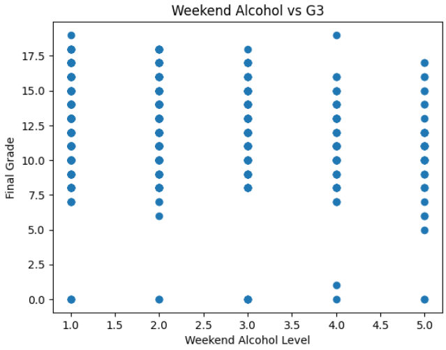
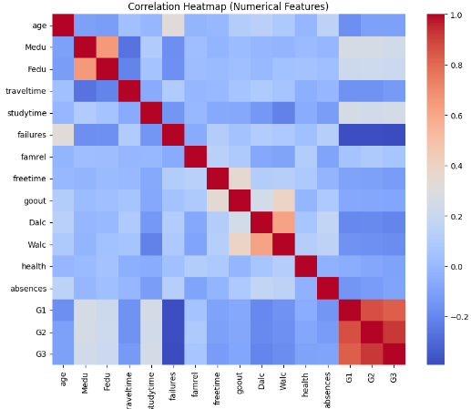
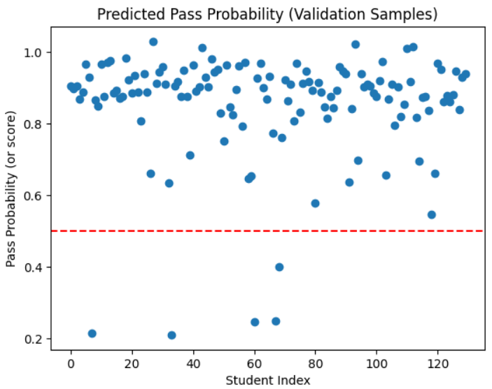

# Can a Machine Learn Who I Am Better Than I Can?
  
This is the core question of **Machine Learning**:

> **Can patterns from past data predict future behavior better than human reasoning?**  
> When does this succeed and when is it just math play ?
---

## PART I – WHAT LEARNING REALLY IS

### What Learning Means

Learning is **not memory**.

> **Learning = turning experience into rules that still work tomorrow.**  
> **Learning = making useful decisions with incomplete and noisy data.**

So true learning is:

- Not storing answers  
- Not hard-coding rules  
- Discovering patterns that **generalize to unseen situations**

> **Real learning = generalization**

---

### Bad Learning vs Real Learning

| Bad Learning | Real Learning |
|----------------|----------------|
| Memorizes answers | Learns patterns |
| Perfect on practice | Works on new problems |
| Zero thinking | Transferable understanding |

---

### Pigeon vs Rat Analogy

- **Pigeon:** repeats actions that once worked without understanding.
- **Rat:** learns what actions actually change outcomes.

**ML aims to build rats, not pigeons.**

---

---

## PART II – THE ML FORMAL SETUP

Every learning system has the same cast:

| Symbol | Meaning |
|--------|---------|
| X | Inputs (features like pixels, age, words) |
| Y | Outputs (labels or targets) |
| D | Real data distribution |
| f | True unknown mapping |
| h | Model approximation |

### Data

\[
(x_1, y_1), (x_2, y_2), ..., (x_m, y_m)
\]

### Model

\[
h: X \rightarrow Y
\]

### Goal

> Learn \( h \) so it behaves like \( f \) on future samples from \( D \).

Plain English:

> Predict unseen data correctly.

---

---

## PART III – THE CORE TENSION

### Training Error

Error on the data the model already saw.

### True Error

Error on unseen real-world data.

**Key danger:**

> Training error can be zero while real-world error is huge.

---

### Overfitting

Unlimited flexibility creates:

- ✅ Perfect training fit  
- ❌ Worthless predictions

**Cause:** learning noise instead of structure.

> Memorizing typos and calling it learning = overfitting.

---

---

## PART IV – ERM AND INDUCTIVE BIAS

### Empirical Risk Minimization (ERM)

From model space \( H \), choose

\[
h = \arg \min L_S(h)
\]

Translation:

> Pick the model that performs best on training data.

---

### Why Restrictions Are Necessary

Allow all models → perfect memorization → no generalization.

Constraint is required:

## Inductive Bias

> **Bias = assumptions forced into the model before seeing data.**

Examples:

| Model | Implicit Belief |
|------|------------------|
| Linear regression | Reality is smooth |
| Decision trees | Reality follows split rules |
| CNNs | Local spatial patterns matter |
| Transformers | Attention structure matters |

> **Your model choice = your worldview in code.**

---

### Why Bias Is Good

| No Bias | Some Bias |
|---------|------------|
| Learns anything | Learns something real |
| Understands nothing | Discovers structure |

> **Bias turns chaos into meaning.**

---

---

## PART V – LIMITS OF LEARNING

### No-Free-Lunch Theorem

> Without assumptions about reality, learning is impossible.

Learning requires believing:

- Patterns exist
- They are stable
- They are simpler than chaos

---

### PAC Learning

Learning is achievable if it is:

- **Probably** (high confidence)
- **Approximately Correct** (small error)

Formally:

- Error ≤ \( \varepsilon \)
- Confidence ≥ \( 1-\delta \)

Data needed increases with:

- Model complexity
- Desired accuracy
- Desired confidence

---

---

## PART VI – CAPACITY AND MEMORIZATION

### VC Dimension

Measures:

> Maximum number of arbitrary labelings a model can handle.

Higher VC = more memorization ability.

Models:

- Deep trees → High VC
- Neural networks → Massive VC

---

### Does High VC Make NNs Useless?

No.

Capacity means:

> **They can overfit, not that they must.**

**Ferrari analogy:**

Ferrari can go 300 km/hr but does not do so constantly.

---

---

## PART VII – WHY NEURAL NETWORKS WORK

**Despite high capacity:**

1. **Regularization**  
   Weight decay, dropout, early stopping

2. **SGD Bias**  
   Optimization prefers simpler solutions.

3. **Architectural Bias**  
   CNN locality, transformer attention constraints

4. **Scale**  
   Big data stabilizes big models.

5. **Training Path Dynamics**  
   Optimization avoids extreme solutions.

---

### VC Is Not Enough

VC theory answers:

> What can a model memorize in worst cases?

Reality asks:

> What does SGD produce in typical cases?

These are not the same.

---

---

## PART VIII – SUPERVISED METHODS

### Linear Models

Perceptrons, linear and logistic regression.

> Separating planes through data.

---

### Boosting

Sequential weak learners combine into strong predictors.

---

---

## PART IX – MODEL SELECTION

Training accuracy lies.

Use:

- Validation sets
- Cross-validation

Goal:

> Balance simplicity and expressivity.

---

---

## PART X – OPTIMIZATION

Models solve:

\[
\min (\text{loss + regularization})
\]

Regularization:

| Type | Effect |
|------|----------|
| L1 | Enforces sparsity |
| L2 | Controls weight magnitude |

---

### SGD

Why used:

- Scales to massive data
- Fast convergence
- Noise helps escape brittle solutions

---

---

## PART XI – OTHER MODELS

### Support Vector Machines

Goal:

> Maximize classification margin.

Uses kernels for nonlinear boundaries.

---

---

## PART XII – BEYOND SUPERVISED LEARNING

### Online Learning

Streaming data. Success measured by **regret**, not accuracy.

---

### Clustering

k-means, spectral, hierarchical.

---

### Dimensionality Reduction

PCA, projections, embeddings.

---

### Generative Models

Learn:

\[
P(x)
\]

Instead of:

\[
P(y|x)
\]

Used for:

- Data generation
- Density estimation
- Anomaly detection

---

---

## PART XIII – BAYESIAN WORLDVIEW

Flow:

> Data → Probabilities → Models → Inference → Decisions

Models predict distributions:

\[
P(y|x)
\]

---

### Bayes Rule

\[
Posterior \propto Likelihood \times Prior
\]

Learning = belief updates from data.

---

### Decision Theory

Predictions guide actions.

Different errors carry different costs.

Models optimize:

> Expected loss, not raw accuracy.

---

---

## PART XIV – CORE MODELS

### Logistic Regression

Probability estimation via:

\[
\sigma(w^T x)
\]

---

### Bias–Variance Decomposition

\[
Error = Bias^2 + Variance + Noise
\]

- Bias: oversimplification
- Variance: instability
- Noise: irreducible randomness

---

### Neural Networks

> Layered nonlinear functions trained by backpropagation.

Failures:

- Overfitting
- Vanishing gradients

Solutions:

- Regularization

---

---

## PART XV – LATENT STRUCTURE

### EM Algorithm

Iterative hidden variable estimation:

- E-Step: infer hidden causes
- M-Step: optimize parameters

---

### KL Divergence

Measures mismatch between probability beliefs.

---

### Graphical Models

Nodes = variables  
Edges = dependencies

---

### PCA

> High-D data lies on low-D manifolds.

Lead to modern embeddings and VAEs.

---

---

## PART XVI – APPROXIMATE INFERENCE

Exact Bayesian inference is intractable.

Use:

### Variational Inference

Approximate posterior via optimization.

---

### MCMC

Random walks through probability space.

---

---

## PART XVII – WHAT YOU ACTUALLY LEARN

You gain a worldview:

- ML = probabilistic belief modeling
- Learning = inference under uncertainty
- Data is finite
- Overfitting is self-deception
- Regularization = discipline

---

---

## CORE TAKEAWAYS

- Overfitting ≠ big models
- Robustness fails under open worlds and dataset shifts
- ML learns correlations, not causes
- Next generation ML blends **data + logic + causality + ethics**

# DATASET ? 

we be using University of california student performence dataset containing academic performance and social lifestyle featues of secondary school lets figure out do our past pattern can help to what happen in future so does our model learning from experience and predicting on our future hence we can say its not memorising its learning thats why we generalize the thing up

## features 
id → Identifier
school → Environment
sex → Demographics
age → Maturity
address → Location
famsize → Household
Pstatus → Stability
Medu → Literacy
Fedu → Literacy
Mjob → Income
Fjob → Income
reason → Motivation
guardian → Supervision
traveltime → Fatigue
studytime → Discipline
failures → Inertia
schoolsup → Intervention
famsup → Support
paid → Coaching
activities → Engagement
nursery → Foundation
higher → Ambition
internet → Access
romantic → Distraction
famrel → Harmony
freetime → Balance
goout → Sociality
Dalc → Indulgence
Walc → Indulgence
health → Vitality
absences → Neglect
G1 → Baseline
G2 → Momentum
G3 → Outcome

## model?

-all features for G3 prediction
-max accuracy with G1,G2 to G3
-all features except G1,G2

Can a student’s daily life predict their future outcome?

## shape !

Rows: 649 students

Columns: 33 features

## types of data

Numeric (int64): 16 columns
age, Medu, Fedu, traveltime, studytime, failures, famrel, freetime, goout, Dalc, Walc, health, absences, G1, G2, G3

## categorical

Numeric (int64): 16 columns
age, Medu, Fedu, traveltime, studytime, failures, famrel, freetime, goout, Dalc, Walc, health, absences, G1, G2, G3

### what to do 
OneHotEncode the object columns

Scale the numeric ones

## what does stats show 

age- mostly normal high school student few older(repeaters)

parent education - most parent atleast middle or secondory school 

family and lifestyle score-

famrel ≈ 3.93 → family relations mostly good

freetime ≈ 3.18 → moderate free time

goout ≈ 3.18 → average social life

Dalc ≈ 1.5, Walc ≈ 2.28 → weekday drinking low, weekend higher

health ≈ 3.53 → general health okay

Absences-

Most students do not skip a lot, but a few are specialists in vanishing.

column skewed and small group is very absent!!

Grades distribution-

All out of 20:

G1 mean ≈ 11.40

G2 mean ≈ 11.57

G3 mean ≈ 11.91

Min 0, max 19

# model pipeline

preprocessor
|
|
|
cat,num
|
|
|
Linear_Regression model 

LinearRegression()

This says:

"Final grade = weighted sum of every feature."

The model learns:

G3 ≈ w1*age 
    + w2*failures
    + w3*studytime
    + ...
    + wN*school_MS

It believes:

Every feature has a fixed contribution.

All effects add up linearly.

No secret interactions or fancy nonlinear boosts

# visualization

# what next

pipeline done 
now binary classification 

features choosing 

now train val diff diff

clf.fit 

evaluate 

# accuracy of it 

Baseline Linear Regression Accuracy: 0.8923076923076924

This graph shows accuracy bias:

High accuracy does not mean high understanding.

Your model isn’t analyzing individuals deeply.
It discovered a lazy policy:

Predict PASS unless something screams FAIL.

✅ Hypothesis 1 — Correlation

Correlation exists:
Your model beats randomness strongly.

✅ Hypothesis 5 — Noise / Irreducible Error

This scatter chaos directly demonstrates:

Even with “good” features, prediction is capped by invisible variables.

Your ceiling is nowhere near 100%.

❌ Partial confirmation of Hypothesis 4

If the model fails THIS badly on known data, imagine population shift.

You’d get worse collapse.

WHY THE LINE PLOT LOOKED BORING

Remember you asked for:

“Line and features vs predicted output”

You only saw nearly flat lines because:

Linear regression assigns small weights.

Your features offer limited discrimination.

Most predictions cluster near pass probability = 0.9.

The slopes exist, they’re simply shallow.

No dramatic gradient because:

Most students don't differ much along your selected dimensions.

Which is a sociological reality check.

didn’t build a "classifier".

You built an averaging machine.

The model doesn't know why a student fails.

It only knows:

Most students pass.

So it rarely dares to predict failure.

This is the tyranny of dataset imbalance + shallow features.

# what next 